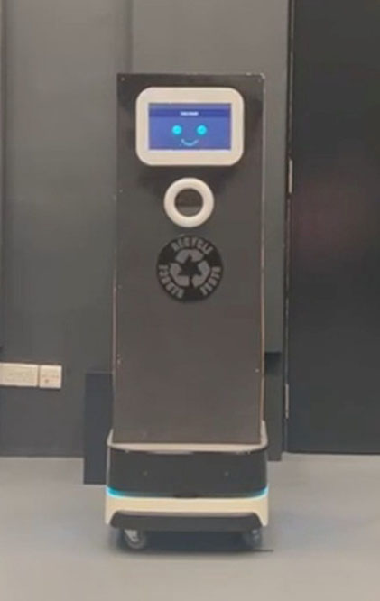
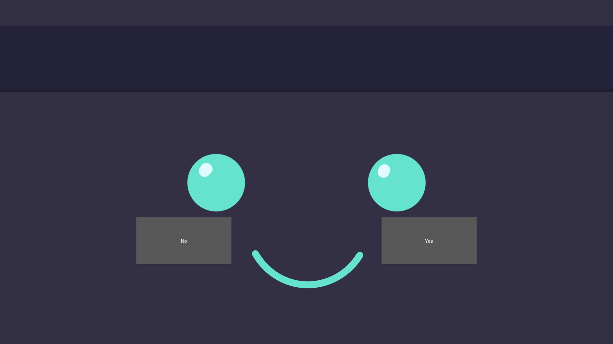

# Nova-Recycle-Bot



**Nova-Recycle-Bot** is a Reverse Vending Machine (RVM) robot on wheels designed for Singapore's 2025 Zero Waste Scheme. It serves the purpose of a recycling vending machine on wheels, sorting items and promoting sustainable recycling practices.

## Overview

Nova is equipped with a Robot Base that utilizes a 2D Lidar to navigate roads while avoiding collisions with people. It efficiently sorts items into two preset categories and prepares them for recycling.

## Objective

The primary objective of Nova is to contribute to Singapore's 2025 Zero Waste Scheme. Operators can map out areas and set checkpoints, creating a defined path for the robot. At each designated area, Nova waits for a specified time period, allowing users to insert their recyclable items (e.g., Cans, Bottles). The robot then sorts the items and places them into appropriate bins based on their category. Users can scan the displayed QR code, which directs them to a redemption website with a token for earning points. These points can be redeemed for items set by the operator.

## Components

List of components used:
1. Robot Base (Main code for the base is not included, but some code is available in GUI.py for customization)
2. Jetson Nano
3. USB Camera
4. pca9685 Servo Driver
5. Mg996R Servo
6. Surface Pro (or any other touch screen display for the GUI)

## Instructions

(Note: This section covers instructions excluding the robot base setup)

1. **GUI Machine:**
   - Using the Surface Pro, connect to a network and open GUI.py.

2. **Jetson Nano Machine:**
   - SSH into the Jetson Nano and connect it to the same network using the command `nmcli device wifi connect`.
   - Start up jet.py using the following steps in order:
     ```bash
     ssh [username]@[Jetson Nano's IP address]
     [Jetson Nano's password]
     sudo nmcli device wifi connect [network] password [network password]
     cd [path to the code directory]
     python3 jet.py
     ```
   - The servos will be tested. Give it some time to calibrate. The GUI should display the robot's status without issues.
   - To test, go to the GUI and press 'Yes'. If the displayed text is not the button, click 'Close'. This indicates that the system is working correctly.

3. **Website Hosting Machine:**
   - Host the website on another machine, which can be on a separate network. A popular choice is using XAMPP with PHP.
   - Drag the `Server` folder into the XAMPP htdocs folder for hosting the website.
   - Make sure the XAMPP control panel's Apache is turned on for the website to be accessible.

## Changing Item Types

1. To change item categories, use your laptop/PC.
2. Open ai.py and use the 'take_pictures' function. Ensure each picture is placed in `/Assets/ImageClassification/[label name]`.
3. After labeling all items, use the 'train' function to train the model.
4. While training on your machine, SSH into the Jetson Nano and ensure the ImageClassification folder has the same labeled folders as your laptop.
5. After training, use the `scp` command to copy the new ImageClassification.h5 to your Jetson Nano's code folder.

   ```bash
   scp /path/to/local/ImageClassification.h5 [username]@[Jetson Nano's IP address]:/path/to/remote/code/folder/
   ```
   Replace /path/to/local/ImageClassification.h5 with the actual path to the new ImageClassification.h5 file on your local machine.
   Replace [username]@[Jetson Nano's IP address] with the SSH credentials for your Jetson Nano.
   Replace /path/to/remote/code/folder/ with the actual path to the code folder on your Jetson Nano.

   For Example:
   ```bash
   scp ~/Downloads/ImageClassification.h5 user@192.168.1.100:/home/user/nova-bot/code/
   ```
   Your setup is now ready to run the entire code again.

## GUI Customization

Place PNG files (only PNG format) within `/Assets/GUI/ImageClasses`, using the same category names used for your folders.

[Watch GUI Introduction Video](Demo/GUI-Intro.mp4)

For any queries, contact [your contact information].
